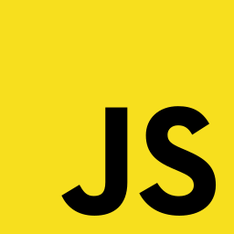
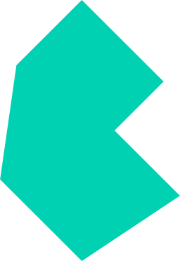
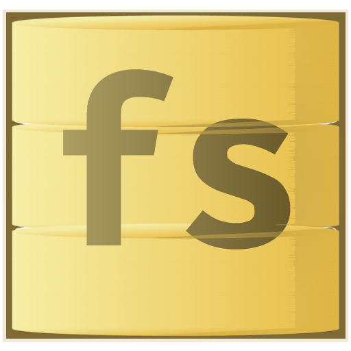
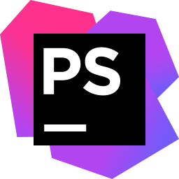

👊 Hi, I’m [@Ambratolm](https://github.com/Ambratolm?tab=repositories). 
🏁 I am interested in making different stuff for all different multimedias. 
🌟 Such as: 💻 Programs, 🎮 Games, 🔊 Audios, 📹 Videos, 🎨 Images, and 📄 Documents. 
🏆 I make things my own way using my own set of tools and methods. 
📁 This account is dedicated to showcase my works in software development. 
📫 Check out 🔗 [**my links**](https://www.ambratolm.cf/p/links.html) and Feel free to ✉ [**contact me**](https://www.ambratolm.cf/p/contact.html) me for anything. 

## ⚒ Used Technologies
### 🏡 Languages and Frameworks

<table><tr><td>

  <!-- General -->
  
  
  
  
  

  <!-- Web-Frontend -->
  
  
  
  
  

  <!-- Web-Backend -->
  
  
  

   

  <!-- Markup -->
  
  
  
  
  

  <!-- Style -->
  
  
  

</td></tr></table>

### 🏪 Database Systems

<table><tr><td>

  <!-- Relational -->
  
  
  
  
  

  <!-- Non-Relational -->
  
  
  
  

</td></tr></table>

### 🏭 Editors and IDEs

<table><tr><td>

  <!-- Editors -->
  
  
  
  

  <!-- IDEs -->
  
  
  

</td></tr></table>

## 📈 Stats

<table>
  <tr>
    <th>Top Languages</th>
    <th>General Stats</th>
  </tr>
  <tr>
    <td>
      
    </td>
    <td>
      
    </td>
  </tr>
</table>

  

