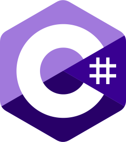
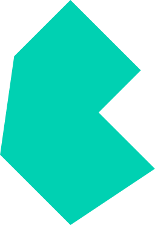

- 🎓 [Practical Works](https://github.com/practical-works)
- 🧱 [Simple Works](https://github.com/simple-works)
- 🕹️ [Ambratolm Games](https://github.com/ambratolm-games)

  
⭐ Favorites

 
<table><tr><td>

  <!-- General -->
  
  
  

  <!-- Web-Frontend -->
  
  
  

  <!-- Web-Backend -->
  
  

<!--     -->

  <!-- Markup -->
  
  
  
  

  <!-- Style -->
  
  
  

</td></tr></table>

<table><tr><td>

  <!-- Relational -->
  
  
  
  
  

  <!-- Non-Relational -->
  
  
  
</td></tr></table>

<table><tr><td>

  <!-- Editors -->
  
  
  

  <!-- IDEs -->
  

</td></tr></table>

 
📊 Stats

   
  <table>
    <tr>
      <td>
        
      </td>
      <td>
        
      </td>
    </tr>
  </table>

  
